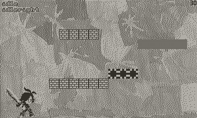

# Yap! - Yet Another Platformer for Playdate

[](https://spdx.org/licenses/MIT.html) [](https://lua.org) [](https://toyboxpy.io) [](https://github.com/DidierMalenfant/Yap/tags)



The name says it all... I'm going to use this project as a showcase for my platformer engine [**Aspen**](https://github.com/DidierMalenfant/Aspen).

This will start small since both [**Aspen**](https://github.com/DidierMalenfant/Aspen) and [**TiledUp**](https://github.com/DidierMalenfant/TiledUp), which **Aspen** uses, are in active development right now.

## Can I create my own levels?

Yep. Levels are edited using [**Tiled**](https://www.mapeditor.org), the tiles used in the levels using [**aseprite**](https://www.aseprite.org). The source files for all the art can be found in the `art` folder.

When exporting levels and tilesets, make sure that your tileset image tables are located in a subfolder of the level's `tmj` file. See the existing level for an example.

## Why does my main character look different?

The main character in the game is by [Blair Ceradsky](https://blairclaw.itch.io/pixelart-action-rpg-swordsman-hero-sprite-pack). I do not own the rights to re-distribute this so this version of the game will use placeholder art instead.

It is easy (and cheap!) to purchase the asset pack yourself and generate the sprite art using the `convPlayer.sh` script found in the `scripts` folder. You will need **didder** (`brew install didder`) and **imagemagick** (`brew install imagemagick`) in order for the script to work. The script should work on **macOS** and **Linux** but it's up to you to port it to **Windows** if you need to.

Unzip the asset pack after you've downloaded from **itch.io**, open a Terminal window and `cd` in to the folder which contains the asset pack folder (`Hiro's Cliúch‚ Quest!! Hero Spritesheets`). Then type the following:

```console
<path-to-yap-folder>/scripts/ConvertPlayerAssets.sh
```

You should then have a file named `player-table-128-128.png` which you can move into a new folder which you will name `source/assets.private/sprites`. Remember that you do **NOT** have the right to re-distribute this png file, either individually or as part of a **public** repo.

## License

**Yap!** is distributed under the terms of the [MIT](https://spdx.org/licenses/MIT.html) license.
